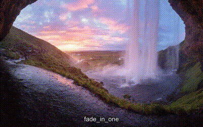

# kburns-slideshow
kburns-slideshow allows the creation of video slideshows from images with kburns (zoom/pan) effect, videos with and without sound and background music.



## Prerequisites

kburns-slideshow is a python application and needs Python 3 installed.
The videos are generated with [FFmpeg](https://ffmpeg.org/) which is needed in Version 3. 
FFprobe is used to extract the duration, width and height of input videos.

To sync the slide changes to the background music the music onsets are extracted with [aubio](https://aubio.org/).

The executables for FFmpeg, FFprobe and aubioonset, which are used, can be set in the `config.json` file.

## Usage
The application can be used by executing `main.py` with some parameters.
```
$ python main.py
```
```
usage: main.py [-h] [-S WIDTHxHEIGHT] [-sd DURATION] [-sdm DURATION]
               [-fd DURATION] [-ft TRANSITION] [-fps FPS] [-zd DIRECTION]
               [-zr RATE] [-sm SCALE_MODE] [-l] [-y] [-t] [-d]
               [-a [FILE [FILE ...]]] [-sy] [-i FILE [FILE ...]] [-f LIST]
               [-s FILE] [-test]
               output_file
```
The default parameters are defined in `config.json` and can be changed with the corresponding command line argument.
An output and one ore more input files (`-i <file>`) are always neccessary:
```
python main.py out.mp4 -i data/1.jpg data/2.jpg data/1.mp4 data/3.jpg
```

It is also possible to define an input file list with modified config parameters and input files. With an input file list it is possible to define some parameters slide specific options (e.g. a overlay text, a subtitle text, a specific transition, a slide duration, a fade duration, ...).
You can use the config file like that:
```
python main.py out.mp4 -f example.json
```

## Parameters

### Command Line Parameters
| Parameter | Description | possible values | default |
| - | - | - | - |
| -S / --size | output size (widthxheight) | int (width) + "x" + int (height)| 1920x1080 |
| -sd / --slide-duration | slide duration (seconds) | int | 4 |
| -sdm / --slide-duration-min | minimum slid duration (seconds), applies only when the slides duration is synced to the music | int  | 1 |
| -fd / --fade-duration | transition duration (seconds) | int | 1 |
| -ft / --fade-transition | the transition type | the names of the available transitions | "random"
| -fps / --fps | output framerate | integer | 60 |
| -zd / --zoom-direction | the zoom direction for the zoom/pan effect | "random", "top-left-in", "top-left-out", "top-center-in", "top-center-out", "top-right-in", "top-right-out", "center-left-in", "center-left-out", "center-center-in", "center-center-out", "center-right-in", "center-right-out", "bottom-left-in", "bottom-left-out", "bottom-center-in", "bottom-center-out", "bottom-right-in", "bottom-right-out" | "random" |
| -zr / --zoom-rate | the zoom rate on the zoom/pan effect | float  | 0.1 |
| -sm / --scale-mode | the scale mode for the zoom/pan effect | "pad", "crop_center", "pan" | "auto" |
| -l / --loopable | create loopable video |   | False |
| -y | overwrite output file |   | False |
| -t  / --temp | generate temporary video files which are later concatenated |   | False |
| -d  / --delete-temp | delete temporary generated video files |   | False |
| -a  / --audio | one or more background audio tracks | one ore multiple files (mp3, ogg, flac) | |
| -sy  / --sync-to-audio | sync the slides changes to the background audio (modify the slides durations) |  | False |
| -i  / --input-files | one or more input files or input folder(s) | one ore multiple files (jpg, jpeg, png, mp4, mpg, avi)  | |
| -f  / --file-list | a JSON file with the input files | a config file which can be generated from the application / see `example.json`  | |
| -s  / --save | save the config and the slides to a JSON file | file name |  |
| -test | do not generate the video, but only test the input |  | False |

### Slide Specific Parameters
When using a JSON input file it is possible to change some values for specific slides:
* `slide_duration`
* `slide_duration_min`
* `fade_duration`
* `zoom_direction`
* `zoom_rate`
* `scale_mode`
* `transition`

```
...
        {
            "file": "1.jpg",
            "slide_duration": 5.0,
            "slide_duration_min": 1.0,
            "fade_duration": 2,
            "zoom_direction": "top-left-out",
            "zoom_rate": 0.2,
            "scale_mode": "crop_center",
            "transition": "fade"
        },
...
```

To disable the zoom/pan effect the `zoom_direction` has to be `none`. When the whole image should be visible the `scale_mode` `pad` is needed.

#### Subtitle
It is possible to define a subtitle for a slide by setting the `title` parameter in the input file list:
```
...
        {
            "file": "1.jpg",
            "title": "Slide 1"
        },
...
```
When using a MP4 output the subtitles are burned in the video. With a MKV output the subtitle is added as individual subtitle stream (default).

#### Overlay
Additionally it is possible to a text `overlay`:
```
...
{
            "file": "1.jpg",
            "overlay": {
                "title": "Intro Text",
                "font": "Bauhaus 93",
                "font_size": 200,
                "duration": 2,
                "transition_x": "left-in"
            }
        },
...
```
A text overlay has a half transparent black background and a overlaying text.
The following parameters can be set for overlays:

| Parameter | Description | default |
| - | - | - |
| title | the text | |
| font | the font | the default FFmpeg font |
| font_size | the font size | 150 |
| duration | the duration for the overlay | 1 |
| transition_x | the text animation which can be "center" (text is positioned on the center), "left-in" (text scrolls from left to the middle) or "right-in" (text scrolls from right to the middle) | "center" |

#### Video parameters
You can disable the audio streams of video inputs by setting `force_no_audio` to `true` on the video input slide:
```
...
        {
            "file": "1.mp4",
            "force_no_audio": true
        },
...
```

If you want only a part of a video you can define the start or end timestamp.
To use a section between second 2 and second 10 the following config is possible:
```
...
        {
            "file": "1.mp4",
            "start": 2,
            "end": 10
        },
...
```
### Transitions
It is easy possible to create custom transitions. Just place a python file in the following format in the folder [slideshow/transitions](https://github.com/Trekky12/kburns-slideshow/tree/master/slideshow/transitions):

```python
def get(end, start, transition, i, fade_duration, config):
    filter = "%(end)s %(start)s <transition> %(transition)s" %{"end": end, "start": start, "transition": transition}
    frames = fade_duration*config["fps"]
    return filter, frames
```
The `get()` function has the following parameters:

| Parameter | Description | default |
| - | - | - |
| end | label of the end section of the previous slide  | "[v%send]" %(i-1)|
| start | label of the start section of this slide | "[v%sstart]" %(i)|
| transition | label for the transition | "[v%strans]" % (i)|
| i | slide number, which can be used for naming labels | |
| fade_duration | the transition duration (seconds) | |
| config | all global config parameters | |

The function needs to return the filter and the number of frames of the transition.

#### ffmpeg-video-slideshow-scripts transitions
I have integrated all video transitions of [ffmpeg-video-slideshow-scripts](https://github.com/tanersener/ffmpeg-video-slideshow-scripts). 

You can get the transitions by buying me two coffees from <a href="https://bmc.xyz/l/kburnstransit" target="_blank"></a>.

I will redirect one coffee to tanersener for his hard work on implementing these transitions.

The bars and checkerboard transitions are configurable with the following global parameters:
```
    "transition_bars_count": 10,
    "transition_cell_size": 100,
```

A preview for each transition is available at [transitions.md](https://github.com/Trekky12/kburns-slideshow/tree/master/transitions.md).

## License
This project is licensed under the [MIT License](https://opensource.org/licenses/MIT).

The ffmpeg-video-slideshow-scripts transitions "bars_horizontal_one", "bars_horizontal_two", "bars_vertical_one", "bars_vertical_two", "checkerboard", "clock", "collapse_both", "collapse_circular", "collapse_horizontal", "collapse_vertical", "cover_horizontal_l2r", "cover_horizontal_r2l", "cover_vertical_b2t", "cover_vertical_t2b", "expand_both", "expand_circular", "expand_horizontal", "expand_vertical", "fade_in_one", "fade_in_two", "moving_bars_horizontal_l2r", "moving_bars_horizontal_r2l", "moving_bars_vertical_b2t", "moving_bars_vertical_t2b", "push_horizontal_l2r", "push_horizontal_r2l", "push_vertical_b2t", "push_vertical_t2b", "rotate_one", "sliding_bars_horizontal_l2r", "sliding_bars_horizontal_r2l", "sliding_bars_vertical_b2t", "sliding_bars_vertical_t2b", "wipe_in_horizontal_l2r", "wipe_in_horizontal_r2l", "wipe_in_vertical_b2t", "wipe_in_vertical_t2b", "wipe_out_horizontal_l2r", "wipe_out_horizontal_r2l", "wipe_out_vertical_b2t" and "wipe_out_vertical_t2b" are also licensed under the MIT license.

The ffmpeg-video-slideshow-scripts transitions "box_in_horizontal_l2r", "box_in_horizontal_r2l", "box_in_vertical_b2t", "box_in_vertical_t2b", "push_box_horizontal_l2r", "push_box_horizontal_r2l", "push_box_vertical_b2t", "push_box_vertical_t2b", "rotate_two" and "spin_blur_rotation" are licensed under the [ARTHENICA Commercial License](https://github.com/tanersener/ffmpeg-video-slideshow-scripts/blob/master/transition_video_scripts/LICENSE.Commercial.txt).

Photo of Jökulsárlón and the photo of Seljalandsfoss are under the [Unsplash license](https://unsplash.com/license)

## Credits
The project is based on [the python implementation](https://github.com/Trekky12/kburns) of [kburns by remko](https://github.com/remko/kburns) and [kburns2 by sargue](https://github.com/sargue/kburns).

A big thanks to [tanersener](https://github.com/tanersener/ffmpeg-video-slideshow-scripts) for doing the hard work of creating the various transitions.

Photo of Jökulsárlón by [Jeremy Bishop](https://unsplash.com/@jeremybishop) on [Unsplash](https://unsplash.com/photos/h7bQ8VEZtws)
Photo of Seljalandsfoss by [Andrey Andreyev](https://unsplash.com/@ludenus) on [Unsplash](https://unsplash.com/photos/dh8ONmfQyQQ)