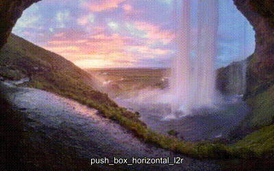
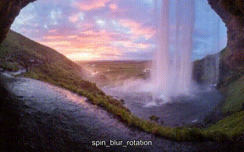

# ffmpeg-video-slideshow-scripts transitions
I have integrated all video transitions of [ffmpeg-video-slideshow-scripts](https://github.com/tanersener/ffmpeg-video-slideshow-scripts). 

You can get the transitions by buying me two coffees from .

I will redirect one coffee to tanersener for his hard work on implementing these transitions.

## Bars
 
 

## Box In
 
 

## Checkerboard

## Clock

## Collapse
 
 

## Cover
 
 

## Expand
 
 

## Fade
fade_in_one equals the default `fade` transition.

 

## Moving Bars
 
 

## Push Box
 
 

## Push
 
 

## Rotate
 

## Sliding Bars
 
 

## Spin Blur Rotation
 

## Wipe In
 
 

## Wipe Out
 
 

# License
The ffmpeg-video-slideshow-scripts transitions 
* bars_horizontal_one
* bars_horizontal_two
* bars_vertical_one
* bars_vertical_two
* checkerboard
* clock
* collapse_both
* collapse_circular
* collapse_horizontal
* collapse_vertical
* cover_horizontal_l2r
* cover_horizontal_r2l
* cover_vertical_b2t
* cover_vertical_t2b
* expand_both
* expand_circular
* expand_horizontal
* expand_vertical
* fade_in_one
* fade_in_two
* moving_bars_horizontal_l2r
* moving_bars_horizontal_r2l
* moving_bars_vertical_b2t
* moving_bars_vertical_t2b
* push_horizontal_l2r
* push_horizontal_r2l
* push_vertical_b2t
* push_vertical_t2b
* rotate_one
* sliding_bars_horizontal_l2r
* sliding_bars_horizontal_r2l
* sliding_bars_vertical_b2t
* sliding_bars_vertical_t2b
* wipe_in_horizontal_l2r
* wipe_in_horizontal_r2l
* wipe_in_vertical_b2t
* wipe_in_vertical_t2b
* wipe_out_horizontal_l2r
* wipe_out_horizontal_r2l
* wipe_out_vertical_b2t
* wipe_out_vertical_t2b

are also licensed under the MIT license.

The ffmpeg-video-slideshow-scripts transitions 
* box_in_horizontal_l2r
* box_in_horizontal_r2l
* box_in_vertical_b2t
* box_in_vertical_t2b
* push_box_horizontal_l2r
* push_box_horizontal_r2l
* push_box_vertical_b2t
* push_box_vertical_t2b
* rotate_two
* spin_blur_rotation

are licensed under the [ARTHENICA Commercial License](https://github.com/tanersener/ffmpeg-video-slideshow-scripts/blob/master/transition_video_scripts/LICENSE.Commercial.txt).